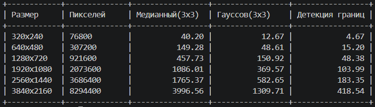

# Библиотека обработки изображений на C с базовыми алгоритмами компьютерного зрения
## Описание проекта
Проект реализует базовые операции обработки изображений, включая свёртки (convolutions) как основу фильтрации и детекции признаков. Может обрабатывать как одно изображение форматов png/jpg/bmp или папку с множеством.

Проект реализован на языке С.

## Функции библиотеки:
1. Медианный фильтр
2. Гауссов фильтр
3. Детекция границ
4. Повышение резкости

## Теория
### Медианный фильтр
Удаляет шум «соль и перец» (белые/чёрные точки). Каждый пиксель заменяется на среднее значение (медиану) соседей. Сохраняет чёткие границы.

$$
I_new(x,y) = median( I(x+k, y+l) ) для k,l ∈ [-n, n]
$$

В окне n×n собираются все пиксели, сортируются берётся средний по порядку.

### Гауссов фильтр
Размывает изображение по формуле Гаусса. Ближние пиксели влияют сильнее, дальние — слабее. Убирает высокочастотный шум, делает картинку мягкой.
#### Формула ядра:
$$
G(x,y) = (1 / (2πσ²)) × e^(-(x² + y²) / (2σ²))
$$
#### Формула свёртки:
$$
I_new(x,y) = Σ Σ I(x+k, y+l) × G(k,l)
$$

σ (сигма) — степень размытия

Чем ближе пиксель к центру, тем больше его вес

Сумма всех весов = 1 (нормализация)

### Детекция границ
Находит контуры объектов с помощью оператора Собеля. Там, где цвет резко меняется, ставит белую (или цветную) линию. Результат — чёрное поле с белыми границами / исходное изображение с цветной границей.
#### Горизонтальный градиент:
$$
Gx = I * Sx, где Sx = [-1,0,1; -2,0,2; -1,0,1]
$$
#### Вертикальный градиент:
$$
Gy = I * Sy, где Sy = [-1,-2,-1; 0,0,0; 1,2,1]
$$
#### Магнитуда границы:
$$
M = √(Gx² + Gy²)
$$
#### Результат:
$$
I_new(x,y) = 255, если M > threshold, иначе 0
$$

Sx и Sy — ядра Собеля

Gx — сила границы по горизонтали

Gy — сила границы по вертикали

M — общая сила границы

### Повышение резкости
Усиливает контраст на границах. Делает изображение более чётким, подчёркивает мелкие детали. Противоположность размытию.
#### Ядро повышения резкости:
$$
K = [ 0,   -s,    0]
    [-s, 1+4s,   -s]
    [ 0,   -s,    0]
$$
#### Формула свёртки:
$$
I_new = I * K
$$

s (strength) — сила эффекта (0.3–2.0)

1+4s — усиливает центр

-s — ослабляет соседей

## Сборка проекта и запуск

```c
gcc img.c -o imgproc -lm
./imgproc
```

## Используемые библиотеки

```c
#include <stdio.h>
#include <stdlib.h>
#include <string.h>
#include <math.h>
#include <ctype.h>
#include <dirent.h>
#include <sys/stat.h>
```

## Результаты
 - Реализованы функции загрузкии сохранения изображения, очистки памяти
 - Медианный фильтр
 - Гауссов фильтр, функция свертки для применения ядра в фильтре
 - Выбор метода и размера ядра для потльзователя
 - Поддержка png/jpg/bmp формата изображений 
 - Детекция границ с выбором черно-белого результата или цветной границы поверх исходного изображения
 - Повышение резкости
 - Обработка одного файла или папки

## Время работы операций на изображениях разного размера


Время измеряется в миллисекундах